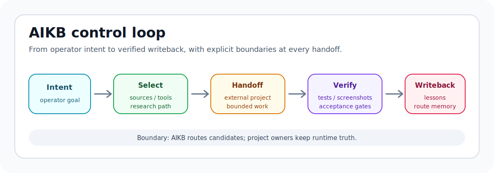

# AI product-control systems for non-engineer operators

I build knowledge-routing, agent-handoff, and verification tools that help an
operator turn intent into selected sources, bounded execution, reviewable
artifacts, and lessons that can be written back without pretending to own final
project truth.

> 中文一句话：我在做 AI 产品开发的控制层，让非工程师 operator 也能把意图、资料、工具选择、外部执行、产物验收和经验回写串成可审查的流程。

[](#selected-public-work)
[](#how-i-work)
[](#boundary)



## Selected public work

The larger AIKB line includes private project material and operator-specific
knowledge. These public repositories are the reusable slices: intake, sidecar
review, claim scope, and operator-facing repair tools.

| Project | What it proves | Start here |
| --- | --- | --- |
| [`mmi-gateway`](https://github.com/baishiqi45-dotcom/mmi-gateway) | Provider-neutral intake for text, documents, pages, images, audio, and video. It turns messy material into review-required candidate packets before downstream systems treat it as truth. | Star it if source review and provenance are part of your agent workflow. |
| [`codex-sidecar-subagents`](https://github.com/baishiqi45-dotcom/codex-sidecar-subagents) | A small pattern for using external models as read-only advisors while Codex keeps file access, local verification, and final judgment. | Star it if you care about bounded multi-agent review instead of model consensus theater. |
| [`epistemic-os`](https://github.com/baishiqi45-dotcom/epistemic-os) | Deterministic claim-scope checks for AI outputs, so candidate notes do not become overconfident release claims. | Star it if your agents need guardrails around evidence strength. |
| [`netfix`](https://github.com/baishiqi45-dotcom/netfix) | A Mac network rescue tool for real operator pain: paste HTTP/SOCKS5 proxy details, preflight, deploy, diagnose, and roll back safely. | Star it if Codex, ChatGPT, GitHub, or agent tools failing to connect has cost you time. |

## The control loop

```text
intent
  -> source / tool / research selection
  -> external project execution
  -> artifact verification
  -> lesson writeback
```

What matters is not "more agents." What matters is making every handoff
inspectable: who received which evidence, what was allowed, what remained
unproven, and what should not be promoted yet.

## How I work

- **Knowledge before execution**: organize source cards, route notes, tool
  boundaries, and capability maps before asking an agent to change a project.
- **Candidate before truth**: intake packets, sidecar reviews, and model output
  are review material until a human or project owner accepts them.
- **Local verification first**: edits, screenshots, tests, logs, and source
  links matter more than confident summaries.
- **Operator-first design**: the system should help a non-engineer decide the
  next safe action, not just produce more technical output.

## Boundary

AIKB is the knowledge, routing, and capability-organization layer. It does not
own runtime execution, provider orchestration, private project assets, billing,
or final artifact acceptance. External project work stays in its owning
workspace; public repos here expose reusable tools and methods.

## Collaboration

For a concrete issue, open it in the relevant repository with:

- the source or workflow you are trying to review;
- what the agent claimed;
- what evidence exists;
- what still needs human acceptance.

If one of the public mechanisms helps your own AI product workflow, starring
that repository is the easiest way to help others find the same pattern.
