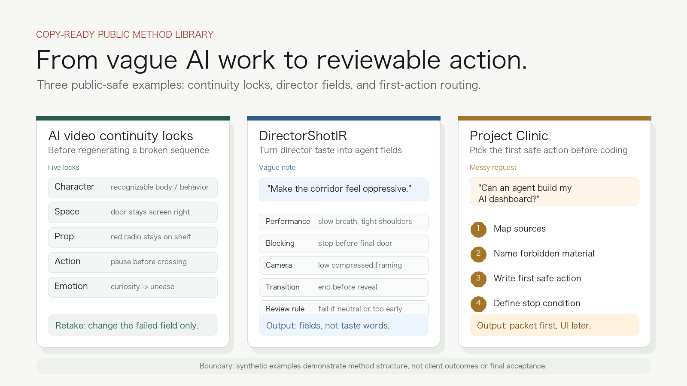
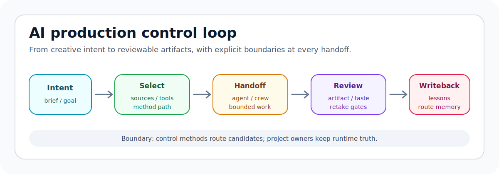

# 白子烨 / Bai Ziye

Film-trained AI production control for video, agents, and non-engineer product work.

I translate director judgment into source selection, AI video shot packages,
agent handoff, retake gates, artifact review, and lesson writeback for
non-engineer operators.

我把导演判断、影像生产、AI coding agent 和产物验收接成一条可审查的控制链。

Beijing Film Academy photography/directing training gave me the image,
narrative, rhythm, continuity, and field judgment. Four months of intense
vibe-coding turned that judgment into AI-native execution surfaces: what source
an agent should read, what a tool output is allowed to prove, when a visual
artifact needs a retake, and what can be written back as reusable method.

[Public site](https://baishiqi45-dotcom.github.io/baishiqi45-dotcom/) ·
[Start in 5 minutes](#start-in-5-minutes) ·
[Methods](methods/README.md) · [Templates](templates/README.md) ·
[Cases](cases/README.md) ·
[Examples](examples/README.md) ·
[Roadmap](ROADMAP.md) ·
[Changelog](CHANGELOG.md) ·
[Contributing](CONTRIBUTING.md) ·
[License](LICENSE) ·
[Open a public-safe issue](https://github.com/baishiqi45-dotcom/baishiqi45-dotcom/issues/new/choose)

## Start From The Failure

| If this is the failure | Start here | Copy this |
| --- | --- | --- |
| AI video shots look fine alone but break as a sequence | [Filled synthetic shot package](cases/SYNTHETIC_SCRIPT_TO_PACKAGE_SAMPLE.md) | [AI video continuity locks](templates/ai-video-continuity-locks.md) |
| A director note like "make it oppressive" cannot become agent work | [DirectorShotIR teardown](cases/CASE_02_DIRECTORSHOTIR_CREW.md#synthetic-teardown-director-note-to-agent-task) | [DirectorShotIR field card](templates/directorshotir-field-card.md) |
| A non-engineer product idea is too messy to code or hire against | [Project Clinic teardown](cases/CASE_03_PROJECT_CLINIC.md#synthetic-teardown-messy-request-to-first-safe-action) | [Project Clinic startup packet](templates/project-clinic-startup-packet.md) |

## What I Am Packaging Publicly

| Public pillar | What I make concrete |
| --- | --- |
| **AI video production control** | Script intent, visual reference roles, shot/package logic, continuity locks, QA boundaries, retake notes, and low-context operator handoff. |
| **Director-style agent workflows** | Turning performance, blocking, camera, transition, asset roles, review rules, and retake targets into agent-readable work. |
| **Project Clinic for non-engineers** | Turning a messy product/workflow idea into source selection, capability route, first task packet, review checklist, and outcome-delta note. |
| **Video admission and verification** | Separating raw artifacts, static evidence, human playback, relation checks, owner seal, and final acceptance boundaries. |

## Why This Is Not A Generic Engineering Profile

I started from Beijing Film Academy photography/directing. The point is not to
pretend I am a conventional full-stack engineer with a film hobby. The useful
edge is translation: image, narrative, rhythm, continuity, taste, and on-set
operator reality becoming AI-native work systems.

Many people can use an AI coding agent casually. The harder layer is knowing:

- what source the agent should read first;
- what a tool output is allowed to prove;
- when a generated artifact is only candidate evidence;
- how to turn a creative failure into a field-level retake;
- what should be written back as reusable method rather than fake project truth.

That is the public lane here.

## Start In 5 Minutes

| If you are facing | Do this first | Then copy |
| --- | --- | --- |
| AI video clips look fine one by one but fail as a sequence | Read the [filled synthetic shot package](cases/SYNTHETIC_SCRIPT_TO_PACKAGE_SAMPLE.md) | [AI video continuity locks](templates/ai-video-continuity-locks.md) |
| A director note like "make it oppressive" cannot become agent work | Read the [DirectorShotIR synthetic teardown](cases/CASE_02_DIRECTORSHOTIR_CREW.md#synthetic-teardown-director-note-to-agent-task) | [DirectorShotIR field card](templates/directorshotir-field-card.md) |
| A non-engineer product idea is not ready for coding or hiring | Read the [Project Clinic synthetic teardown](cases/CASE_03_PROJECT_CLINIC.md#synthetic-teardown-messy-request-to-first-safe-action) | [Project Clinic startup packet](templates/project-clinic-startup-packet.md) |
| A workflow has demos, screenshots, reports, and no current truth | Start with the [workflow rescue map](templates/workflow-rescue-keep-kill-map.md) | [Outcome-delta writeback note](templates/outcome-delta-writeback-note.md) |
| A video artifact exists but nobody knows if it is reviewable | Use the [video admission ladder](templates/video-admission-ladder.md) | [AI video continuity locks](templates/ai-video-continuity-locks.md) |

The fastest route is: read one filled synthetic example, copy one blank
template, fill only public-safe or owner-approved material, then open an issue
only if the question can be discussed without private assets.

## How The Control Loop Works

The pixel identity is the public face. The diagram below is the operating
model: intent becomes source selection, then agent handoff, then artifact
review, then bounded retake or writeback.

## Public Case Tracks

These case tracks expose method and boundaries, not private assets or final
project truth.

| Case | Public value |
| --- | --- |
| [Script to dispatchable AI video packages](cases/CASE_01_SCRIPT_TO_PACKAGES.md) | How script intent becomes visual reference roles, image evidence, package review, retake logic, and operator handoff. |
| [Filled synthetic script-to-package sample](cases/SYNTHETIC_SCRIPT_TO_PACKAGE_SAMPLE.md) | A complete public-safe example using an invented scene, not private script or production material. |
| [DirectorShotIR and crew-style agent work](cases/CASE_02_DIRECTORSHOTIR_CREW.md) | How one vague "AI brain" becomes role-based creative responsibility: director, art, camera, critic, QA. |
| [Project Clinic for non-engineers](cases/CASE_03_PROJECT_CLINIC.md) | How one messy request becomes a source bundle, first task packet, review checklist, and reusable lesson. |

## Use This Repo When

Use this repository as a public reference for:

- AI video continuity review before more generation spend;
- director-style agent task packets instead of vague prompts;
- non-engineer project startup packets before hiring or coding;
- video admission gates that stop weak evidence from becoming final claims;
- public-safe templates you can copy into private owner workspaces.

If a template or synthetic example saves you a false start, a star is a useful
bookmark. Stars are not proof of product quality, client outcome, or final
artifact acceptance.

## How I Work

- **Case before tool:** a tool is worth naming only when it changes a real
  production, product, or verification decision.
- **Evidence before claim:** model output, sidecar advice, dry-runs, screenshots,
  and fixtures stay candidate material until the right owner accepts them.
- **Director judgment into operator language:** taste, continuity, rhythm, and
  camera intent become inspectable instructions, not vague prompts.
- **Boundary first:** private project material stays in its owner workspace. The
  public layer shows method, synthetic examples, templates, and review contracts.

## Collaboration

Useful conversations usually start with one of these:

- an AI video or short-drama workflow that keeps failing at continuity, rhythm,
  asset control, or review;
- a non-engineer product idea that needs a source/tool/agent execution route
  before hiring engineers or opening a large build;
- an AI workflow with many artifacts but no reliable acceptance boundary.

Use the issue templates in this repository for public, method-level discussion.
Do not upload private scripts, raw media, provider screenshots, account state,
customer material, or final project acceptance truth to public issues.

Read [CONTRIBUTING.md](CONTRIBUTING.md) before opening a pull request. The
accepted contribution types are intentionally narrow: synthetic examples,
template clarity, broken-link fixes, and public-safe method language.

## Public Building Blocks

These repositories are supporting slices. They are not the headline.
Manual profile pinning guidance: [GitHub profile pinning](docs/GITHUB_PROFILE_PINNING.md).

Reference repos and what they prove

| Repository | Use this if | Public status | Not claimed |
| --- | --- | --- | --- |
| [`mmi-gateway`](https://github.com/baishiqi45-dotcom/mmi-gateway) | You need an intake pattern for turning messy material into review-required candidate evidence. | Reference slice | Not the current product identity. |
| [`codex-sidecar-subagents`](https://github.com/baishiqi45-dotcom/codex-sidecar-subagents) | You need the read-only advisor pattern where Codex keeps file access, verification, and integration judgment. | Reference slice | Not autonomous truth or final acceptance. |
| [`epistemic-os`](https://github.com/baishiqi45-dotcom/epistemic-os) | You need claim-scope guardrails so weak evidence does not become confident AI release language. | Guardrail slice | Not a complete runtime system. |
| [`netfix`](https://github.com/baishiqi45-dotcom/netfix) | You need a practical Mac network rescue utility for operator downtime. | Utility satellite | Not part of the AI video method library. |

